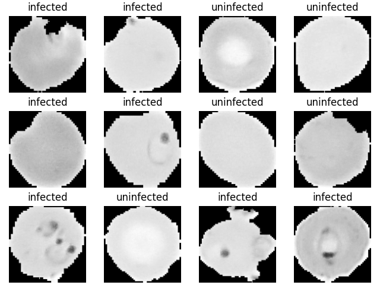

# Autoencoders and Variational Autoencoders

For this task I chose the malaria dataset from [kaggle](https://www.kaggle.com/datasets/iarunava/cell-images-for-detecting-malaria). This contains images of infected and uninfected cells of malaria. Some of the samples are shown below.

The code for training Autoencoders is available in the directory `autoencoders`. Running the `train.py` file with the appropriate config file yields the results presented below.
