# Autoencoders and Variational Autoencoders

For this task I chose the malaria dataset from [kaggle](https://www.kaggle.com/datasets/iarunava/cell-images-for-detecting-malaria). This contains images of infected and uninfected cells of malaria. Some of the samples are shown below.

The code for training Autoencoders is available in the directory `autoencoders`. Running the `train.py` file with the appropriate config file yields the results presented below.

## Autoencoder

First, I trained a simple autoencoder with the learning curves shown below.

| | |
|---|---|
|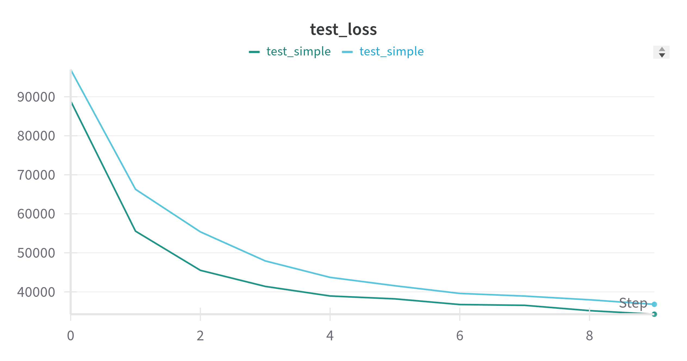 | 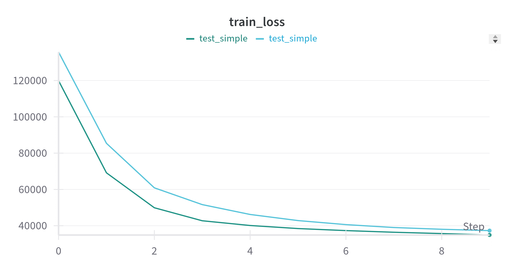 |

Below I shown the t-SNE representation of the 20 dimensional latent space (the bottleneck layer) and inference on some random examples, the top image is the original and directly below, there is the reconstruction. It can be seen very clearly that most of the network's effort is put into reconstructing the cell boundary. And the latent space does also not form any clusters corresponding to infected and uninfected cells. The other model is run with 50 latent space dimensions bu the results are pretty much the same.

| Latent space | Inference |
|---|---|
| 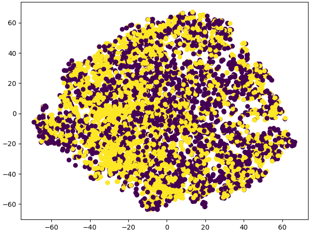 | 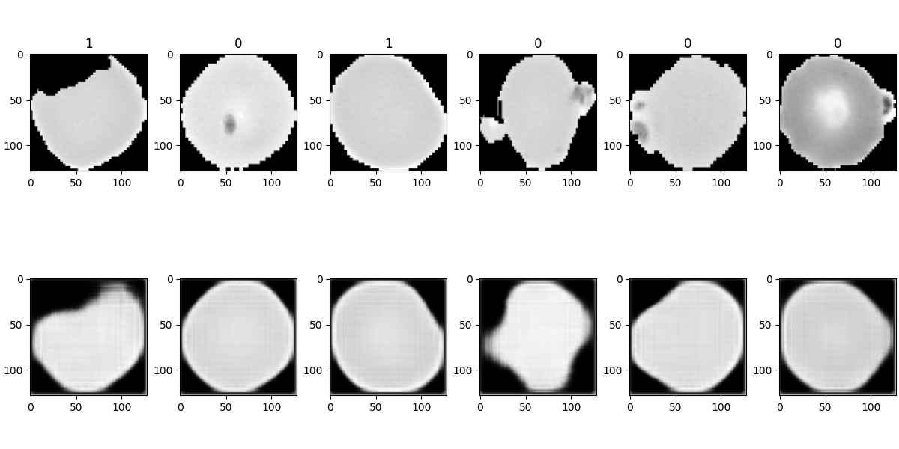 |

Next, I tried smoothing the images such that the zero padded areas are replaced with the mean value of the cell's interior. The idea being that the network should not learn the cell shape but rather the distinct masses inside the cell's that indicate malaria. The results are below. We can see that the latent space is somewhat better than previously -- there are more yellow dots on the left and purple dots on the right. However, there definitely is no clear distinction between infected and uninfected cells. The reconstructions are better in the sense that not the cell boundary is important but the distinct masses are now reconstructed.

| Latent space | Inference |
| --- | --- |
| 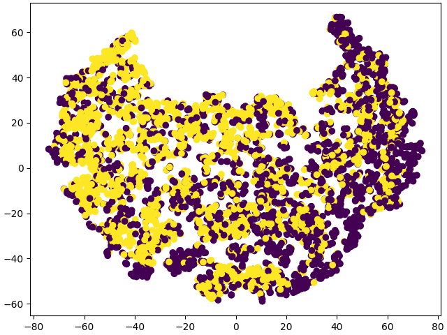 | 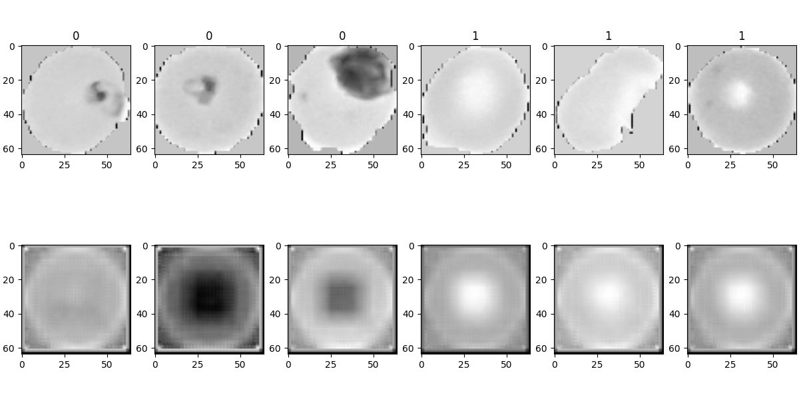 |
| 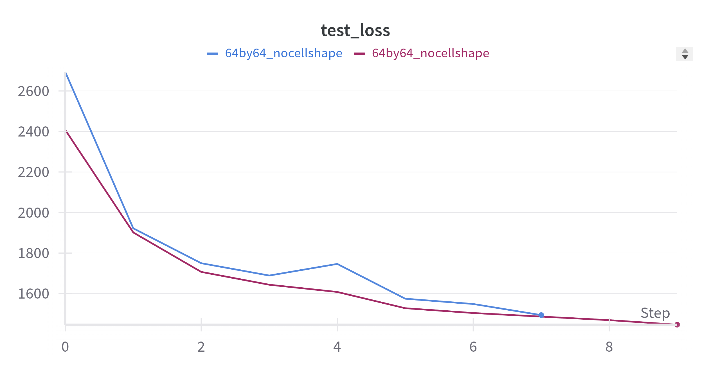 | 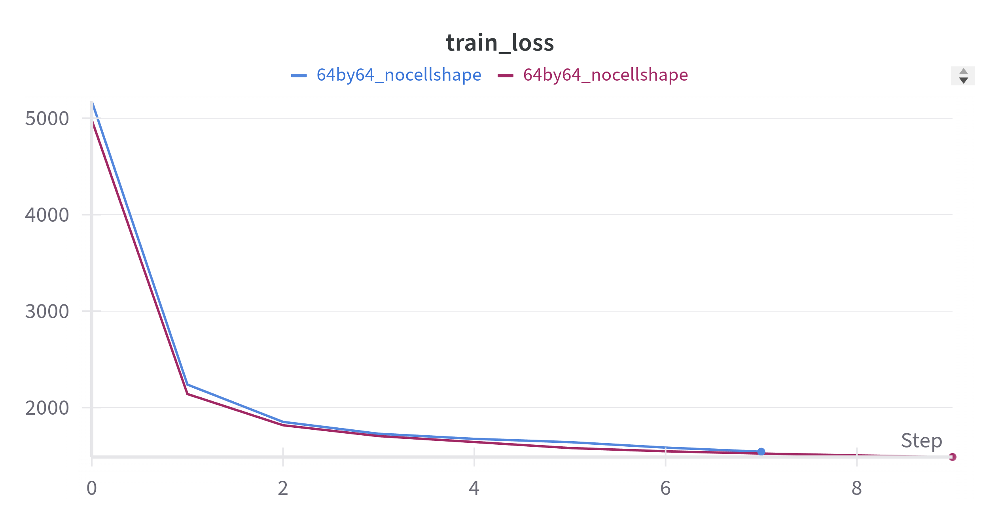 |

## Variational autoencoder

These are results without removing the cell boundary and they look very similar to the previous case. Most of the effort is in the reconstruction of the cell shape and the latent space does not show anything about whether the cell is infected or not.

| Latent space | Inference |
| --- | --- |
| 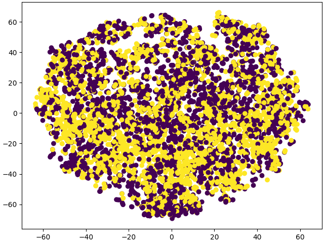 | 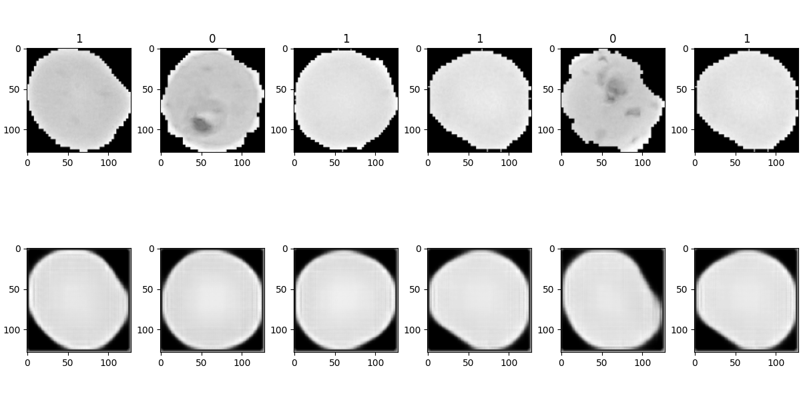 |
| 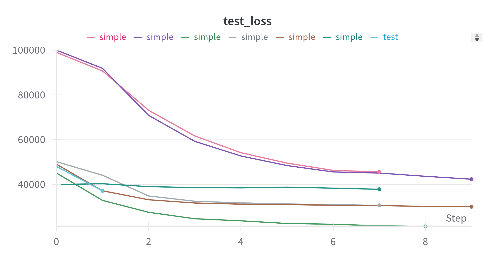 | 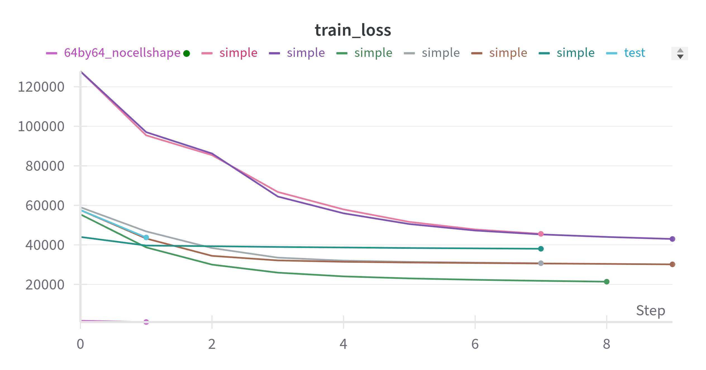 |

And these are the results with removing the cell boundary. Again, very similar to the previous case. Difference being that the latent space is learned even worse in terms of if the cell is infected or not. The other model is run with 50 latent space dimensions bu the results are pretty much the same.

Thus, for this task the regular autoencoder performs a little better.

| Latent space | Inference |
| --- | --- |
| 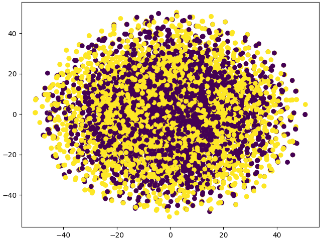 | 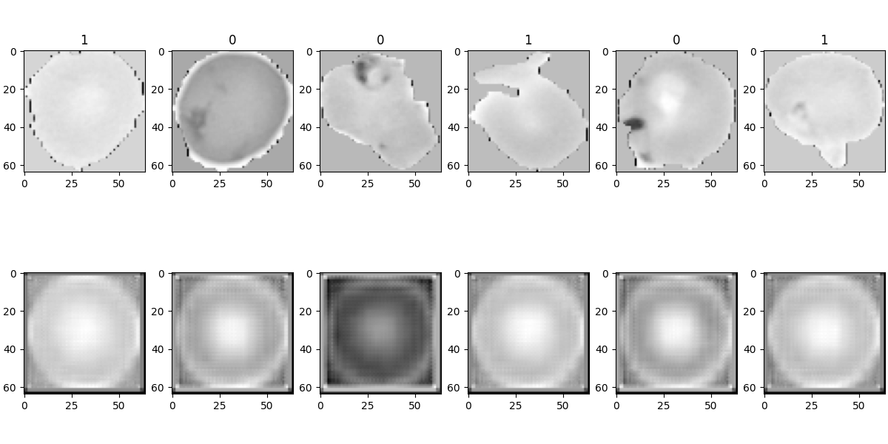 |
| 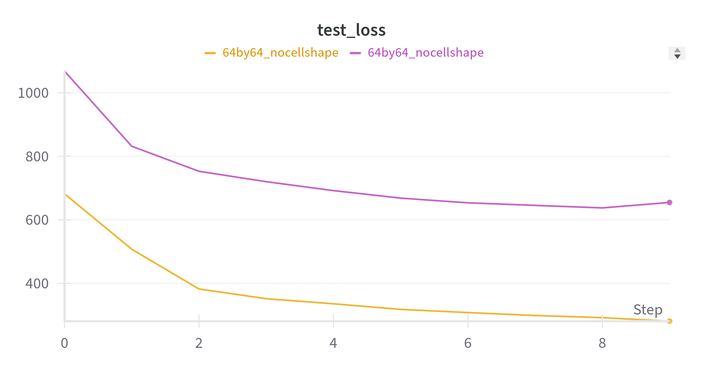 | 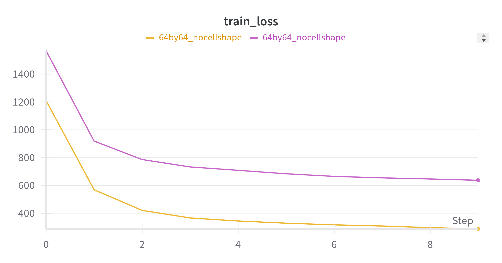 |
