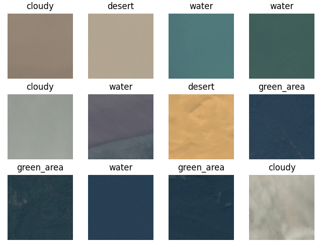
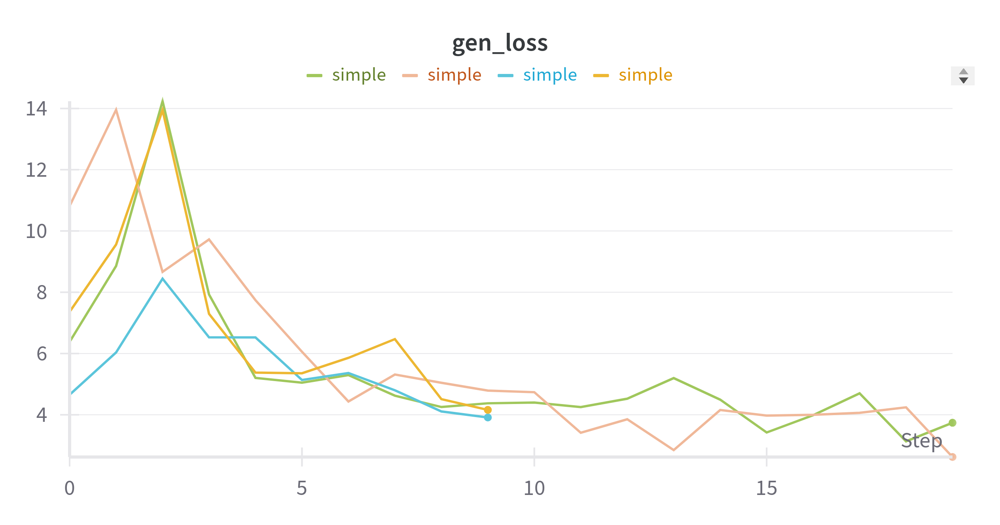
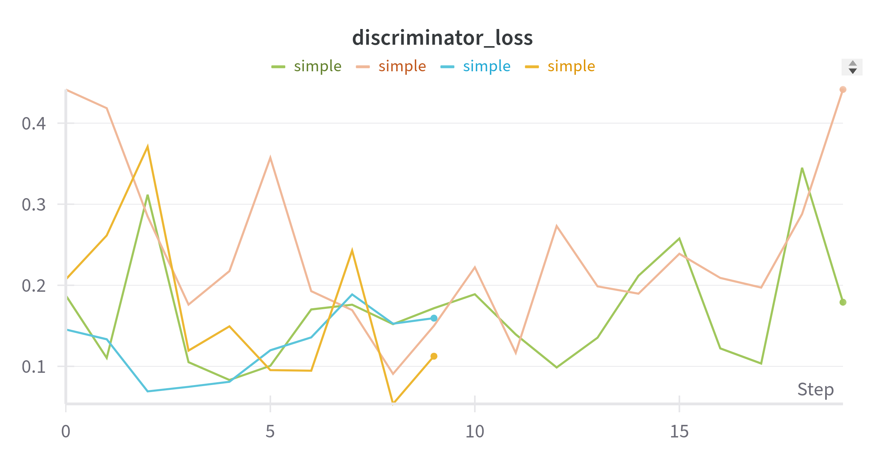
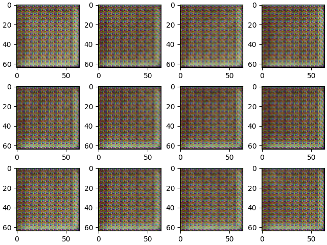
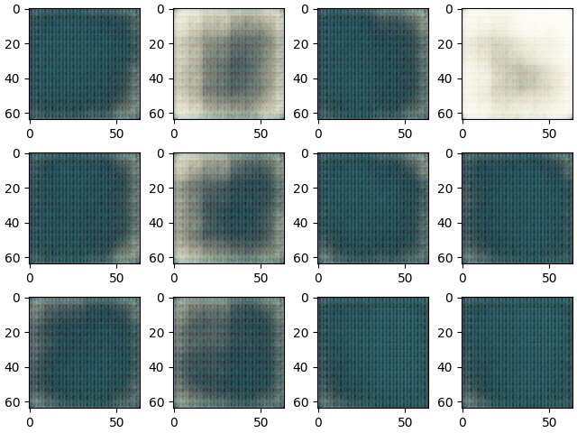
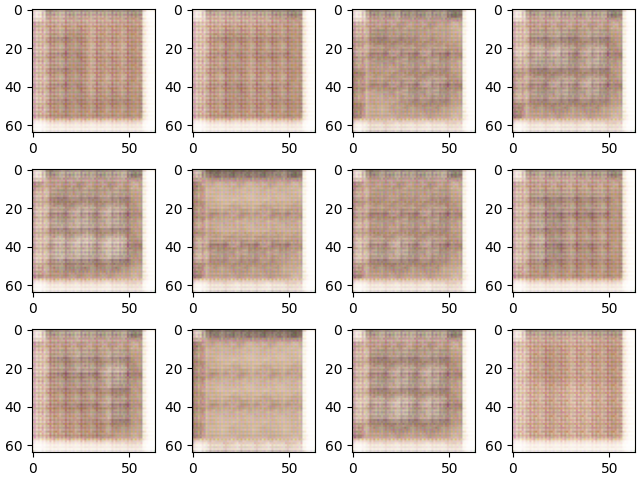

# Generative Adversarial Networks

Here I chose the dataset of satellite images from [kaggle](https://www.kaggle.com/datasets/mahmoudreda55/satellite-image-classification). This dataset has images from 4 different regions

- cloudy,
- desert,
- green_area and
- water.

Some samples are plotted below

The code for training GANs is available in the directory `gan`. Running the `train.py` file with the appropriate config file yields the results presented below.

The learning curves are shown below, from which we can see that the networks both train.

| | |
| --- | --- |
|  |  |

The interesting thing was that each trained model chose one of the four classes to generate. For example the orange model generates images of deserts with slight cloudiness. But the green model generates images of either cloudy water or cloudy green areas. What is more, I list the second epoch of the green model as well, so that the progress can be seen. All generated images have a very distinct grid pattern that is a known issue with the transposed convolution used.

| Green model epoch 2 | Green model best generation (cloudy water) | Orange model best generation (desert) |
| --- | --- | --- |
|  |  |  |
