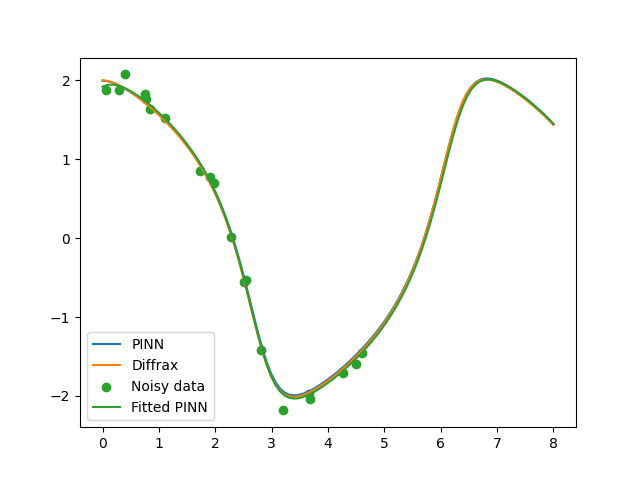

# Van der Pol equation with Physics Informed Neural Networks

The [van der Pol equation](https://en.wikipedia.org/wiki/Van_der_Pol_oscillator) is a second order ordinary differential equation describing oscillations with non-linear damping.

```math
\frac{d^2 x}{dt^2} - \mu(1-x^2) \frac{dx}{dt} + x = 0
```

The equation was derived for electrical circuits that include vacuum tubes. But has found applications in other fields as well such as the Fitzhugh-Nagumo model for action potential propagation in nerve axons.

## Solving the equation with PINNs

In PINNs we want the neural network to be the unknown function $NN(t; \theta) \approx x(t)$, where $\theta$ are the parameters. We set up a regular Feed Forward Network and train it with a loss function that converges to zero when the neural network represents the soultion.

In order to have a unique solution we need two initial conditions
$$u(t=0)=u_0 \qquad \frac{d}{dt}u(t=0) = u_0'.$$

We learn the soultion in certain time steps in an interval $t\in[0, t_0]$ for $N$ steps. The loss function consists of two parts -- $L_2$ loss of both of the initial conditions and the $L_2$ loss of the equation

```math
\begin{align*}
\mathcal{L}(\theta) &= (NN(0, \theta) - u_0)^2 + \left( \frac{d}{dt}NN(0, \theta) - u_0' \right)^2 \\
&+ \frac1N \sum_{i=0}^N \left( \frac{d^2}{dt^2}NN(t_i, \theta) - \mu(1-NN(t_i, \theta)^2) \frac{d}{dt}NN(t_i, \theta) + NN(t_i, \theta) \right)^2
\end{align*}
```

The time derivatives can be found with autodifferentiation.

## Solving an inverse problem

In the inverse problem we are given noisy measurements of the data. We assume that the data is described by the differential equation and then the ODE solution, that is our neural network in this case, is fitted to the data. The goal is to find the values of the parameters.

In this case the parameter is $\mu$. The loss function consists of two parts -- $L_2$ loss of the data against solution and $L_2$ loss of the equation

```math
\begin{align*}
\mathcal{L}(\theta) &= \frac1M \sum_{j=1}^M ( NN(t_j, \theta) - x_j )^2 \\
&+ \frac1N \sum_{i=0}^N \left( \frac{d^2}{dt^2}NN(t_i, \theta) - \mu(1-NN(t_i, \theta)^2) \frac{d}{dt}NN(t_i, \theta) + NN(t_i, \theta) \right)^2,
\end{align*}
```

where $x_j$ is the data point at time $t_j$. The difference now is that we optimize not only with respect to the parameters of neural network $\theta$ but we also include the parameter $\mu$. This way we can recover the original $\mu$ used to generate the data.

## Results

In order to reproduce these results, one should just run the script `pinn/vanderpol.py`.



The orange line shows the solution calculated by the Diffrax package and serves as a reference case here. The blue line is the equation solved using PINN. As we can see the solution overlaps the reference case very well. Next some random data is generated, 20 time values are chosen uniformly in the interval $[0, 5)$ and random gaussian noise with variance 0.1 is added to the Diffrax solution. The result shows that the PINN was successfully fitted to the data and it also predicts the solution quite well in the interval $[5, 8]$ where no data was provided.
